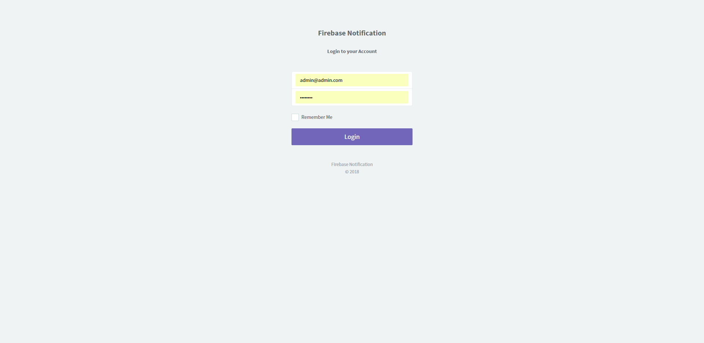
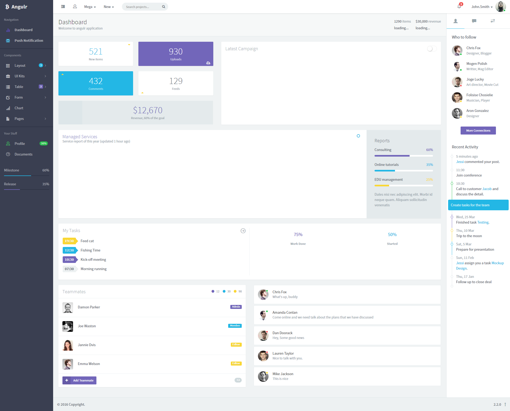
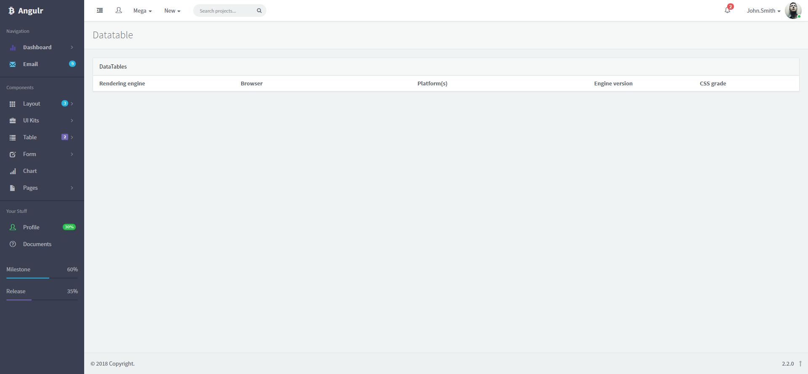

"#Firebase Notification with PHP MySQL BackEnd" 

### Show some :heart: and star the repo for the project
     

This repository containing Firebase Notification with PHP MySQL BackEnd Admin Panel .

### Some Screenshots

<h1> Login Page </h1>
 

<h1> DashBoard Page </h1>
  

<h1> History Page </h1>
  

